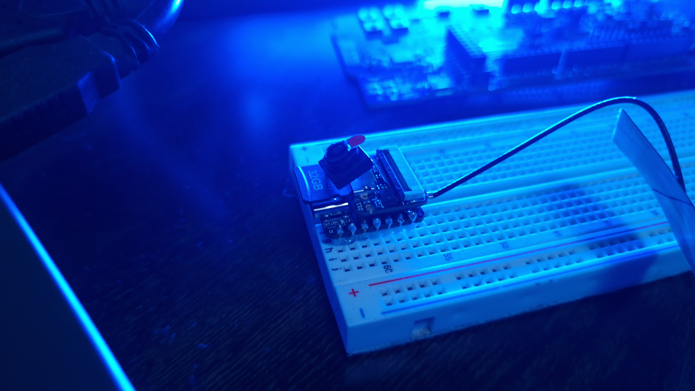

# Edge Impulse Experiments

# Introduction

Edge Impulse Experiments are a powerful new feature that allows users to run multiple active impulses within a single project. This enables seamless experimentation with various model configurations on the same dataset, offering a more efficient way to compare results.

The updated interface includes a new "Experiments" section, which centralizes impulse management and integrates the EON Tuner for enhanced trial handling. Along with API enhancements and streamlined processes, these changes significantly accelerate development and improve project organization, making it easier to transition from data collection to deployment.

This project provides a walk through of how to use experiments, along with source codes and a tutorial that will help you get started with Edge Impulse Experiments.

## Hardware

- Seeed XIAO ESP32 S3 Sense [More Info](https://docs.edgeimpulse.com/docs/edge-ai-hardware/mcu/seeed-xiao-esp32s3-sense)
- microSD card (32GB MAX)
- microSD card reader

## Platform

-  Edge Impulse [Visit](https://www.edgeimpulse.com)

## Software

- Edge Impulse CLI [Download](https://docs.edgeimpulse.com/docs/edge-impulse-cli/cli-installation)
- Arduino CLI [Download](https://arduino.github.io/arduino-cli/latest/)
- Arduino IDE 2.2.1 [Download](https://www.arduino.cc/en/software)

# Getting Started

## Format SD Card
First you will need to format your SD card if you are using one. You can use software such as [SD Card Formatter](https://www.sdcardformatter.com/) for this task to easily format your card.

## Seeed XIAO ESP32 S3 Sense

The Seeed Studio XIAO ESP32S3 Sense is a compact development board powered by the dual-core ESP32S3 chip, running at up to 240 MHz. It supports both Wi-Fi and Bluetooth Low Energy (BLE) and comes with a detachable OV2640 camera sensor with a resolution of 1600x1200, plus a digital microphone. With 8MB of PSRAM, 8MB of FLASH, and an external SD card slot, the board is ideal for embedded machine learning (ML) projects.

First you should set up your Seeed XIAO ESP32, connecting the antenna and the expansion board to the top of the XAIO ESP32. The expansion board simply clicks in place using the B2B connector. Once the expansion board is in place, insert your formatted SD card into the SD port on the device.

# Edge Impulse

## Create Edge Impulse Project

Now it's time to create your Edge Impulse project. Head over to [Edge Impulse](https://studio.edgeimpulse.com/), log in, ad create your new project.

Once your project is created, you will see the project dashboard which will show you new additions to the platform.