# Edge Impulse Experiments


# Introduction

Edge Impulse Experiments are a powerful new feature that allows users to run multiple active impulses within a single project. This enables seamless experimentation with various model configurations on the same dataset, offering a more efficient way to compare results.

The updated interface includes a new "Experiments" section, which centralizes impulse management and integrates the EON Tuner for enhanced trial handling. Along with API enhancements and streamlined processes, these changes significantly accelerate development and improve project organization, making it easier to transition from data collection to deployment.

This project provides a walk through of how to use experiments, along with source codes and a tutorial that will help you get started with Edge Impulse Experiments.

## Hardware

- Arduino Nano RPI2040 Connect [More Info](https://store.arduino.cc/products/arduino-nano-rp2040-connect)

## Platform

-  Edge Impulse [Visit](https://www.edgeimpulse.com)

## Software

- Edge Impulse CLI [Download](https://docs.edgeimpulse.com/docs/edge-impulse-cli/cli-installation)
- Arduino CLI [Download](https://arduino.github.io/arduino-cli/latest/)
- Arduino IDE 2.2.1 [Download](https://www.arduino.cc/en/software)

# Getting Started

## Arduino Nano RPI2040 Connect

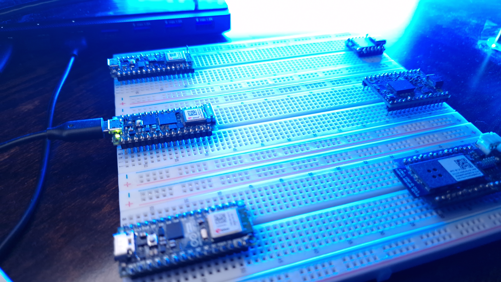

The Arduino Nano RP2040 Connect is a highly versatile development board, bringing the power of the Raspberry Pi RP2040 microcontroller to the compact Nano form factor. Equipped with dual-core 32-bit Arm Cortex-M0+ processors, it enables seamless creation of IoT projects with built-in Wi-Fi and Bluetooth support via the U-blox Nina W102 module. The board includes an accelerometer, gyroscope, RGB LED, and omnidirectional microphone, making it ideal for real-time data collection and embedded AI applications.

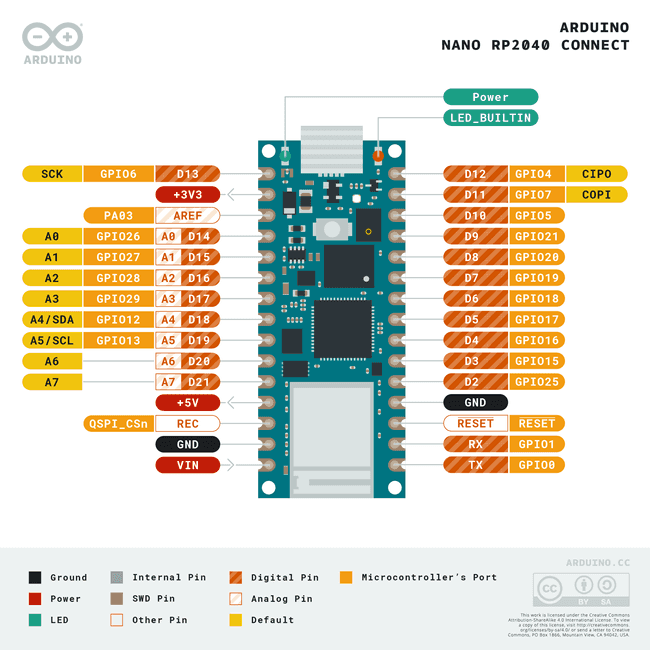

The Nano RP2040 Connect is fully compatible with the Arduino Cloud platform, allowing users to rapidly prototype IoT solutions. It also supports MicroPython for those who prefer Python for programming. With a clock speed of 133 MHz, the board is well-suited for machine learning tasks, offering support for frameworks like TinyML and TensorFlow Lite. Additionally, its 6-axis IMU and temperature sensor expand the board’s capability for advanced real-world applications.

To begin working with the Edge Impulse platform and the Nano RPI2040 Connect, follow [this tutorial](https://docs.edgeimpulse.com/docs/edge-ai-hardware/mcu/raspberry-pi-rp2040) to connect your device.

# Edge Impulse

## Create Edge Impulse Project

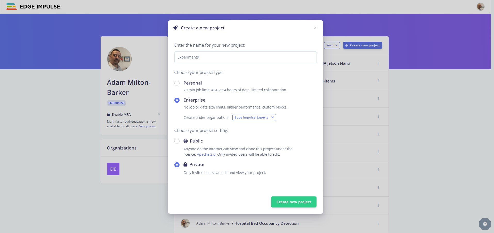

Now it's time to create your Edge Impulse project. Head over to [Edge Impulse](https://studio.edgeimpulse.com/), log in, and create your new project.

Edge Impulse offers experiments to all users, with the community tier allowing up to three simultaneous experiments. Users on the Professional Plan and Enterprise tiers enjoy unlimited access to experiments. You can explore all the platform’s advanced features by signing up for an [Enterprise Trial](https://studio.edgeimpulse.com/trial-signup).

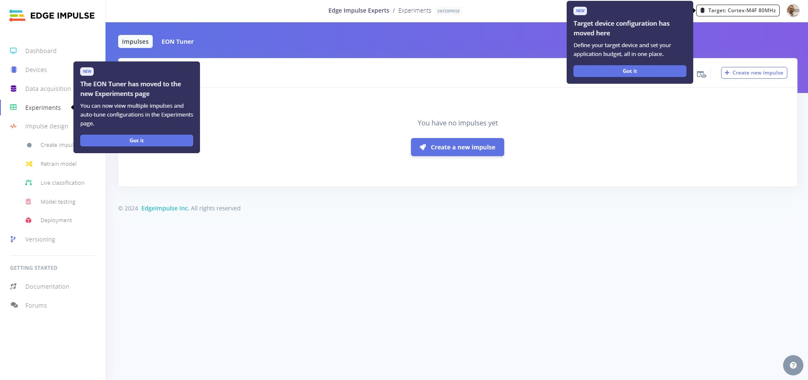

Once your project is created, you will see the project dashboard which will show you new additions to the platform.

## Connect Your Device

Next you need to connect your device to the Edge Impulse platform. Ensuring you have the Nano connected to your computer, open commandline or terminal and use the following command:

```bash
edge-impulse-daemon
```

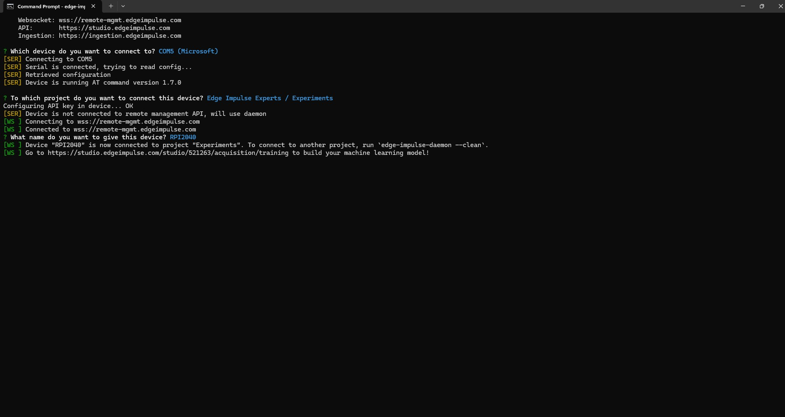

You will be prompted for your Edge Impulse login details to proceed. Once authenticated you will need to choose the COM port that your device is connected to, and then select the Edge Impulse project you want to connect your device to.

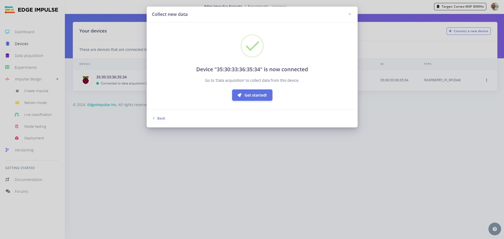

If you now head over to your project and go the `Devices` tab, you will see your device is now connected.

## Collect Data

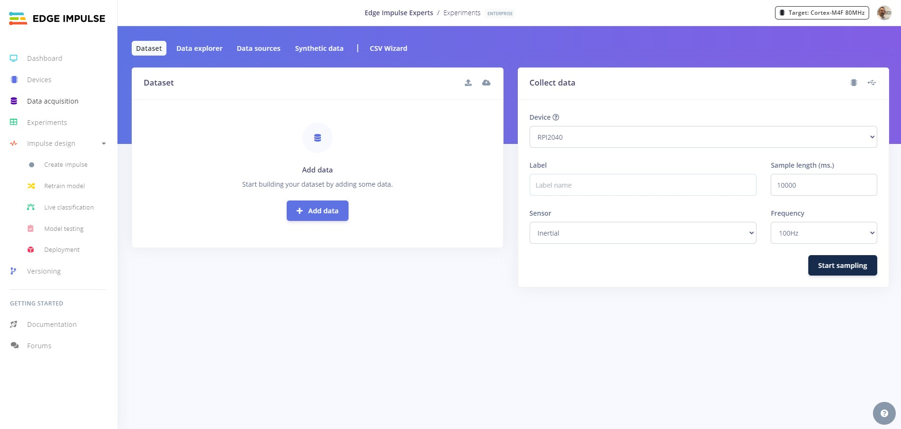

Now that your device is connected to Edge Impulse. It is time to collect some data. Head over to the `Data aquisition` tab and select the RPI2040.

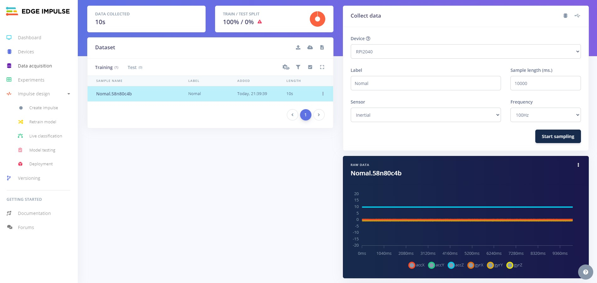

First we will create the `normal` data. This data will represent when a machine is running normally with no abnormal vibrations. Select the `Intertial` sensor and use `Normal` as the label. Next record about 3 minutes of 10 second samples from the device.

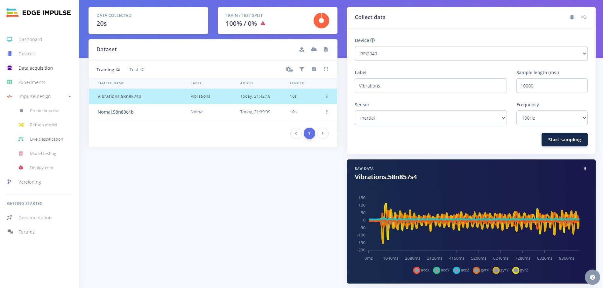

Next we will collect the `Vibrations` data. Change the label to `Vibrations` and record 3 minutes more of samples, but this time shake the Arduino around while the samples are being recorded.

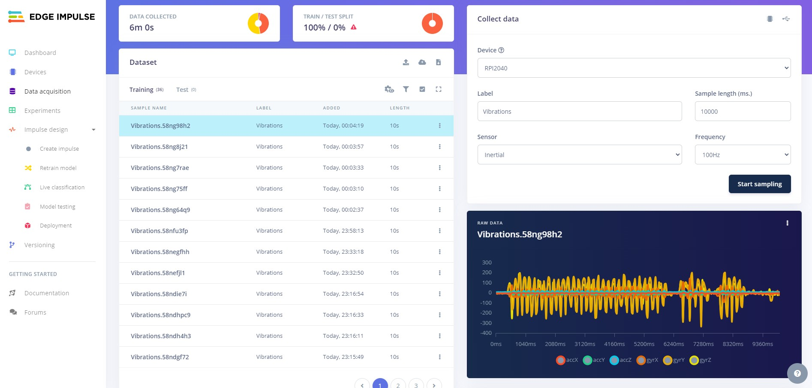

You should now have about 6 minutes of data. Note that at this point the data is not split into training and validation.

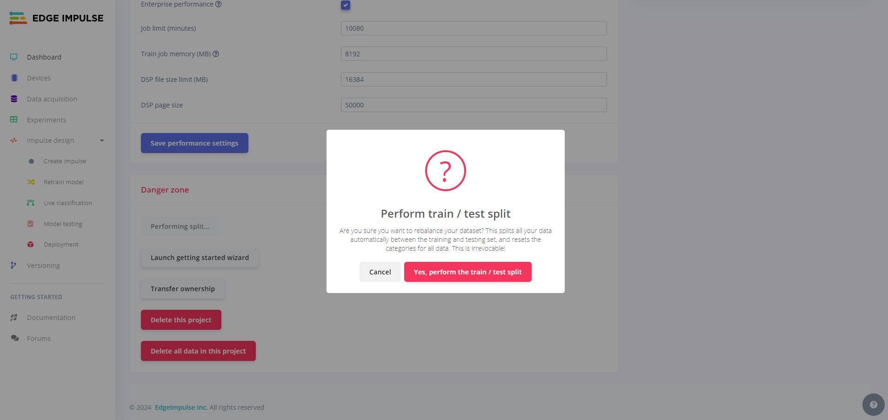

Head to the project dashboard and scroll to the `Danger Zone` at the bottom. Click on the `Perform train/test split` button to split the data.

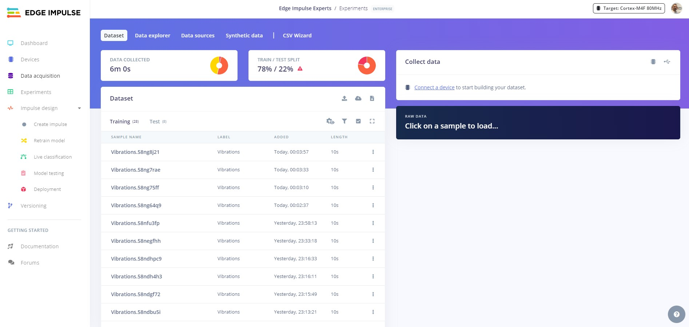

Back on the `Data aquisition` tab, you will now see that the data has been split.

## Create Impulse

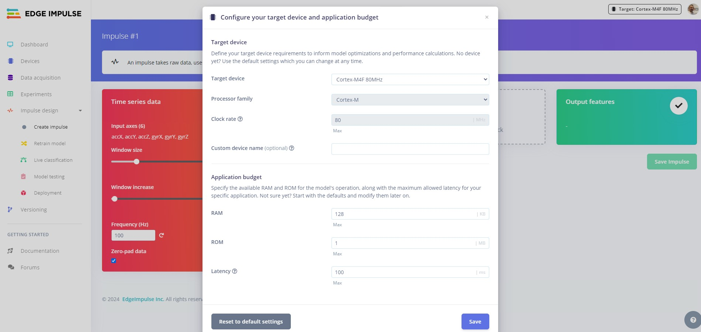

Now it is time to create your Impulse. Head over to the `Create Impulse` tab and you should see the configuration for your Nano RPI2040. You can accept the defaults here.

## Spectral Analysis

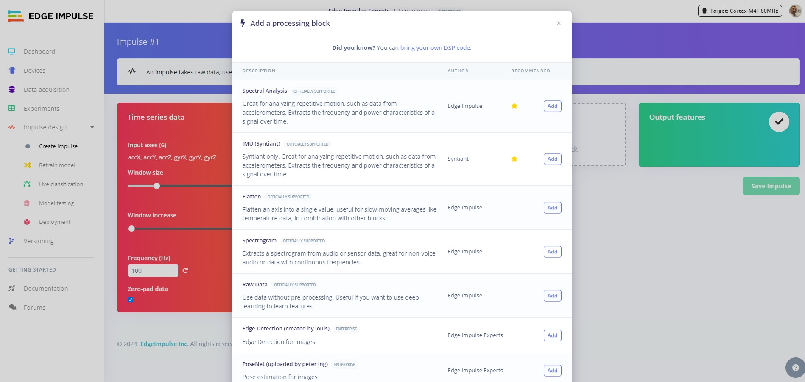

First we will use the `Spectral Analysis` processing block. Spectral Analysis is ieal for examining repetitive movements, particularly using accelerometer data, this tool breaks down signals to reveal their frequency and power patterns over time.

Click `Add` to add the Spectral Analysis processing block to your Impulse.

## Classification

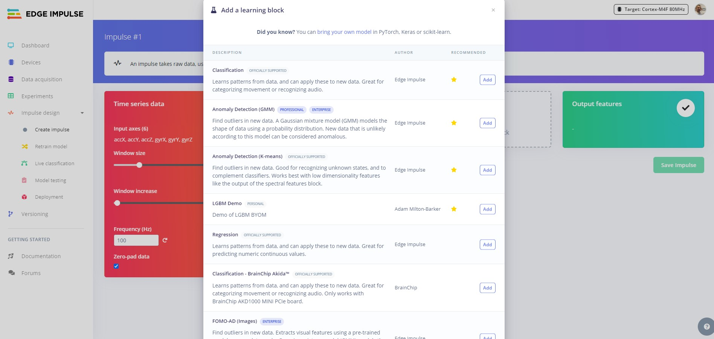

For the learning block, we will use `Classification` to classify between `Normal` and `Vibrations`. Click `Add` to add the classification block to your Impulse.

Next click `Save Impulse`.

## Feature Generation

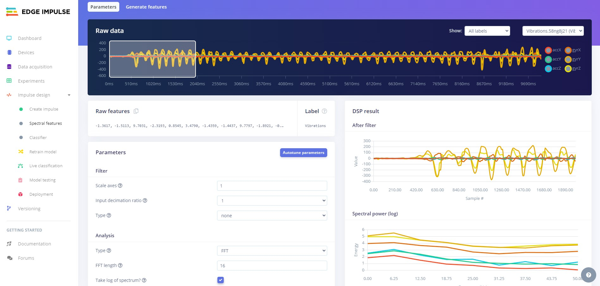

Now we will generate the features that the AI model will use to learn. Head over to the `Spectral Features` tab and click on `Autotune parameters`. An autotune job will start and you will see the output on the right hand side of the UI.

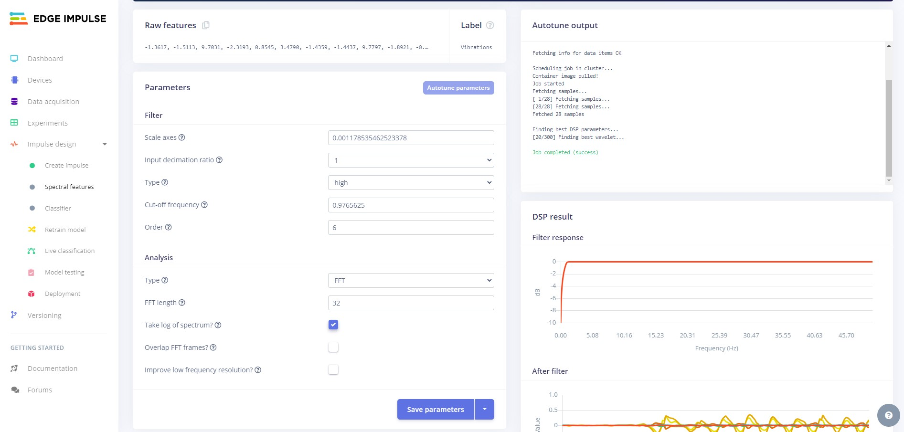

Once the job is complete click `Save parameters`. You will be redirected to the `Generate features` tab.

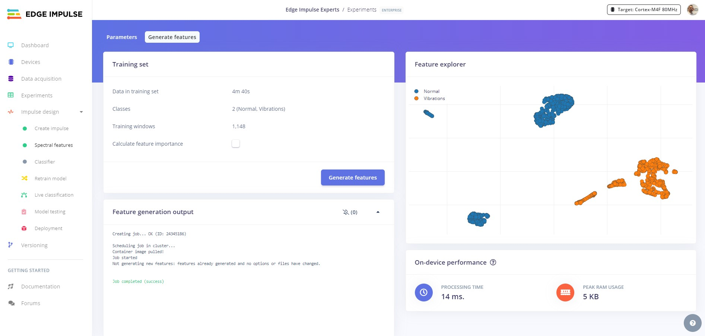

A feature generation job will start, and once finished you will see the features on the right hand side. The features should be nicely clustered, if you notice features that are not clustered correctly you can click on them, review the samples and update your dataset or settings to fix.

## Training

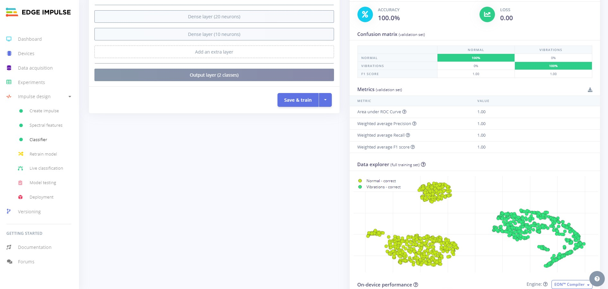

Now it is time to train our model. Head over to the `Classifier` tab and click on `Save and train`.

A training job will start, once trained you will see the results on the right hand side of the UI.


